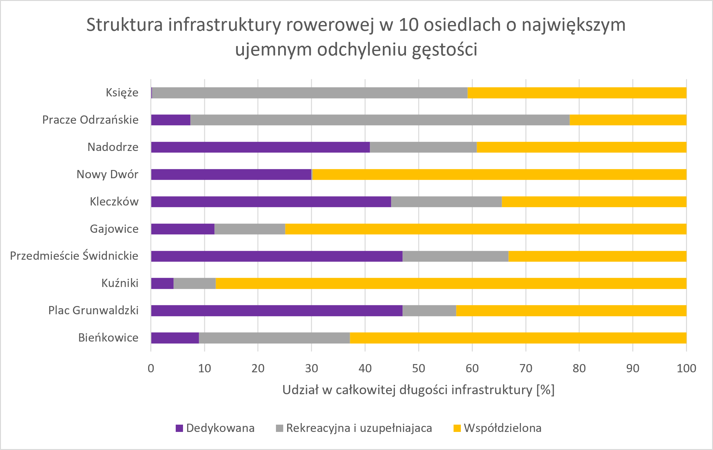
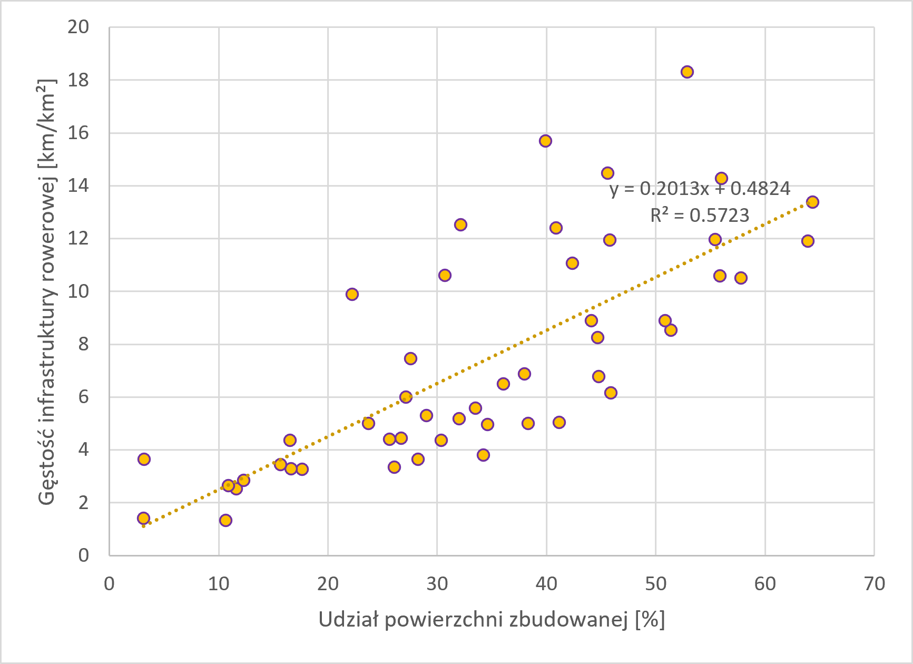
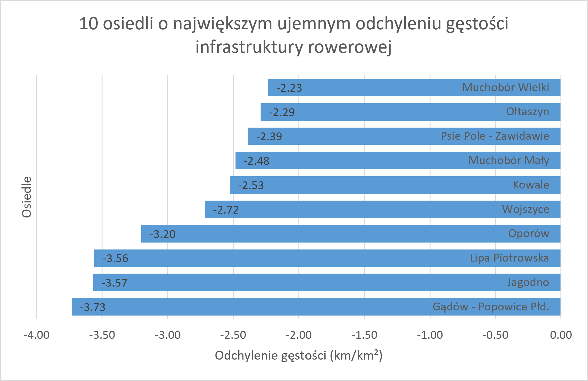
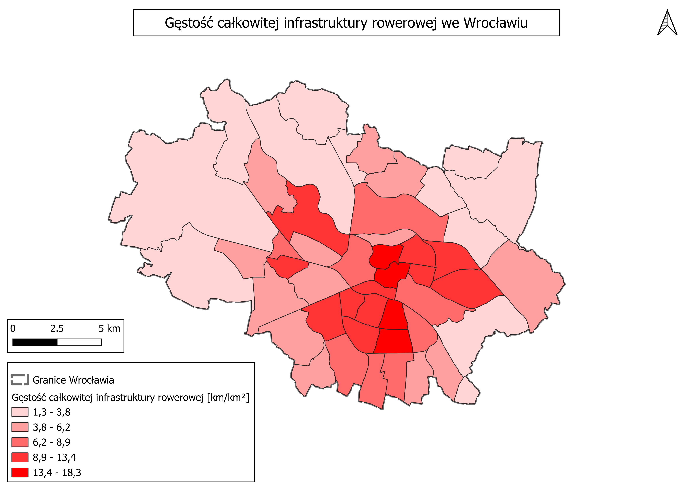
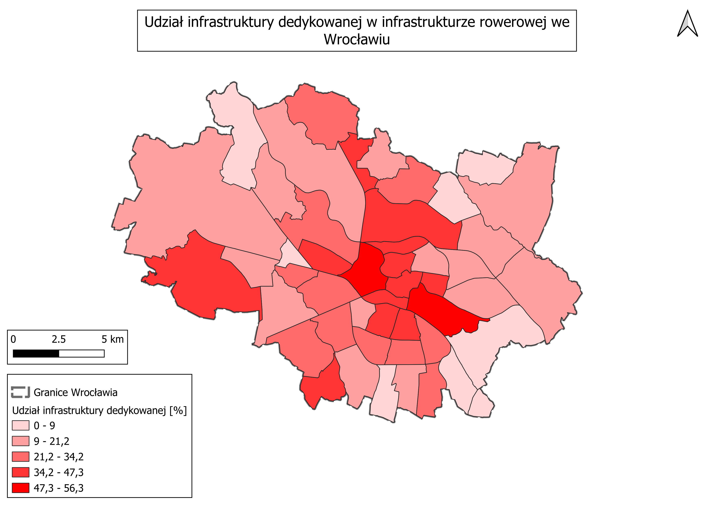
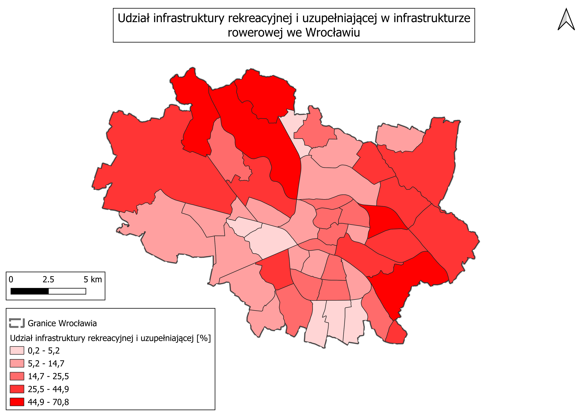
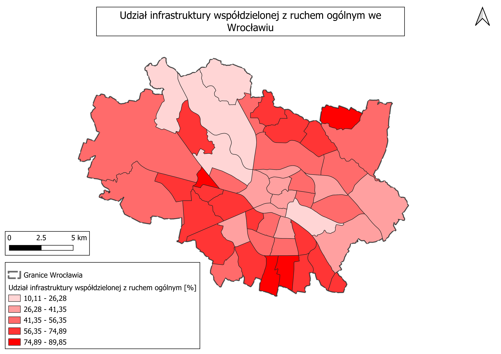
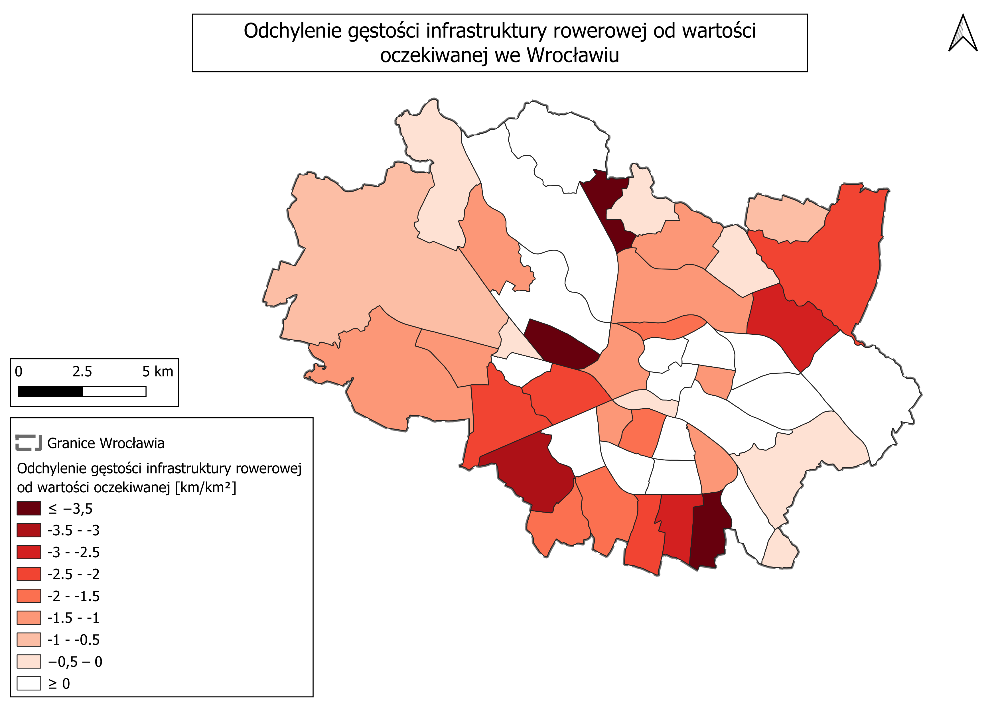
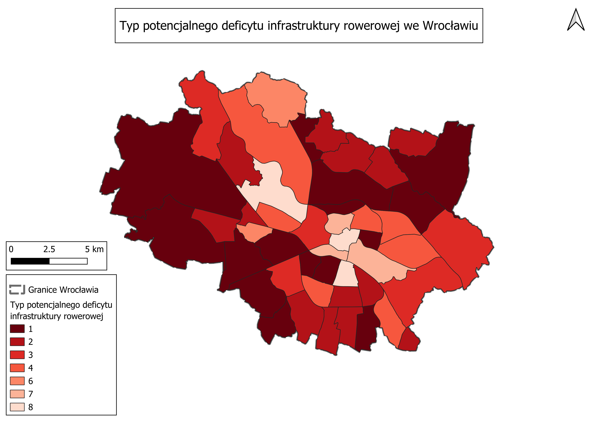

# Dostępność i potencjalny deficyt instrastruktury rowerowej we Wrocławiu

## Cel projektu

Celem projektu jest analiza przestrzennego rozmieszczenia, gęstości oraz struktury infrastruktury rowerowej we Wrocławiu z podziałem na osiedla.

W pierwszym etapie analizowana jest całkowita długość i gęstość infrastruktury rowerowej oraz jego struktura z uwzględnieniem trzech kategorii:
* infrastruktura dedykowana,
* infrastruktura współdzielona z ruchem ogólnym,
* infrastruktura rekreacyjna i uzupełniająca.

W drugim etapie analizowany jest związek pomiędzy stopniem zabudowania osiedli a gęstościa infrastruktury rowerowej. Na postawie tej zależności wyznaczana jest oczekiwana gęstość infrastruktury dla poszczególnych osiedli, a następnie obliczane jest odchylenie gęstości rzeczywistej od wartości oczekiwanej. 

Pozwala to wskazać osiedla, w których gęstość infrastruktury jest niższa od wartośći wynikającej z obserwowanego wzorca, oraz pozwala określić strukture potencjalnego deficytu gęstości infrastruktury rowerowej. 

Projekt ma charakter eksploaracyjnej analizy przestrzennej. Wartość "potencjalnego deficytu" oznacza odchylenie od wartości oczekiwanej przez model statystyczny i nie stanowi bezpośredniej miary rzeczywistego zapotrzebowania na infrastrukturę.

## Pytania badawcze

1. Jak różni się gęstość i struktura infrastruktury rowerowej pomiędzy osiedlami Wrocławia?
2. Czy udział powierzchni zabudowanej jest związany z gęstością infrastruktury rowerowej oraz które osiedla wykazują największe odchylenie od wartości oczekiwanej?
3. Jak różni się struktura potencjalnego deficytu gęstości infrastruktury rowerowej pomiędzy osiedlami o największym ujemnym odchyleniu od wartości oczekiwanej?

# Dane

## Infrastruktura rowerowa

Podstawą analizy były dane liniowe dotyczące infrastruktury rowerowej we Wrocławiu, pozyskane z:

- [SIP Wrocławia](https://geoportal.wroclaw.pl/www/pliki/DaneRowerowe/TrasyRowerowe.zip) — główne źródło danych o infrastrukturze,

Dane pobrano: **sierpień 2026**.

Warstwę infrastruktury poddano selekcji, kontroli geometrii oraz klasyfikacji do trzech kategorii analitycznych:

- **infrastruktura dedykowana** — przeznaczona przede wszystkim dla ruchu rowerowego;
- **infrastruktura współdzielona z ruchem ogólnym** — odcinki, na których ruch rowerowy odbywa się wspólnie z ruchem samochodowym;
- **infrastruktura rekreacyjna i uzupełniająca** — odcinki o funkcji rekreacyjnej lub wspierającej podstawową sieć transportową.

Szczegółowe przypisanie klas źródłowych do kategorii analitycznych przedstawiono w tabeli poniżej.

| Kategoria analityczna | Klasy źródłowe z SIP / OSM |
|---|---|
| Dedykowana | droga dla pieszych i rowerów, droga dla rowerów, pas ruchu dla rowerów, kontrapas |
| Współdzielona z ruchem ogólnym | pas BUS + Rower, kontraruch, strefa ruchu uspokojonego 20 i 30 |
| Rekreacyjna i uzupełniająca | trasa na wałach,trasa przez park, możliwość przejazdu, łącznik drogowy |

## Granice osiedli

Do agregacji wyników wykorzystano granice 48 osiedli Wrocławia, pozyskane z:

- [SIP Wrocławia](https://geoportal.wroclaw.pl/www/pliki/osiedla/granice-osiedli.zip)

Granice służyły do przypisania odcinków infrastruktury do poszczególnych osiedli oraz obliczenia ich powierzchni.

## Powierzchnia zabudowana

Do modelowania oczekiwanej gęstości infrastruktury wykorzystano udział powierzchni zabudowanej w powierzchni każdego osiedla.

Wskaźnik obliczono według wzoru:

   `udział powierzchni zabudowanej [%] = powierzchnia zabudowana / powierzchnia osiedla × 100`

Źródło warstwy powierzchni zabudowanej:

- [Urząd Marszałkowski Województwa Dolnośląskiego](https://geoportal.dolnyslask.pl/getfile/open/bdot10k/0264_powiat_m_Wroclaw.zip)

## Układ współrzędnych

Analizy długości i powierzchni wykonano w układzie współrzędnych **ETRF2000-PL / CS2000/18**

Zastosowanie układu metrycznego umożliwiło poprawne obliczenie długości odcinków oraz powierzchni osiedli.

# Metodologia

## Sumowanie długości
Dla każdego osiedla obliczono
   * długosć infrastruktury dedykowanej
   * długość infrastruktury rekreacyjnej i uzupełniającej
   * długośc infrastruktury współdzielonej z ruchem ogólnym
   * całkowitą długość infrastruktury rowerowej

Długośći zostały przeliczone z metrów na kilometry

## Gęstość infrastruktury
W celu umożliwienia porównania osiedli o różnej powierzchni obliczono gęstość infrastruktury:

   `DENSITY = całkowita długość infrastruktury [km] / powierzchnia osiedla [km²]`

Wskaźnik wyrażano w:
   `km infrastruktury / km² powierzchni osiedla`

Analogicznie wskaźniki obliczono osobno dla trzech kategorii infrastruktury.

## Struktura infrastruktury
Dla każdego osiedla obliczono udział poszczególnych kategorii w całkowitej długości infrastruktury rowerowej
Pozwala to określić czy infrastruktura danego osiedla opiera się przede wszystkim na:
   * infrastrukturze dedykowanej
   * współdzielonej,
   * rekreacyjnej i uzupełniającej 

Do wizualizacji przestrzennej wybranych zmiennych użyto metodę naturalnych przerw (Jenksa), dobierając klasy oddzielnie dla każdej analizy.

## Zależność między stopniem zabudowania a gęstością infrastruktury
Następnie przeanalizowano zalezność pomiędzy udziałem powierzchni zabudowanej a gęstością infrastruktury rowerowej
Wykorzystano:
   * regresję liniową
   * współczynnik determinacji  R²
   * korelację rang Spearmana
   test istotności statystycznej korelacji

Model regresji liniowej przyjął postać:

   `y = 0.2013x + 0.4824`

gdzie:
   `x - udział powierzchni zabudowanej [%]`
   `- oczekiwana gęstość infrastruktury rowerowej [km/km2]`

Model osiągnął:
   
   `R² = 0,5723`

Współczynnik korelacji rang Spearmana wyniósł:
   
   `ρ = 0,807`

przy:

   `ρ < 0,001`

Wyniki wskazują na silną dodatnią zależność pomiędzy stopniem zabudowania a gęstością infrastruktury rowerowej.

## Oczekiwana gęstość infrastruktury

Wartość oczekiwana nie stanowi normy ani docelowego poziomu infrastruktury. Jest to **wartość przewidywana przez model regresji liniowej** na podstawie udziału powierzchni zabudowanej w danym osiedlu.

Dla całkowitej gęstości infrastruktury model przyjął postać:

   `oczekiwana gęstość [km/km²] = 0,2013 × udział powierzchni zabudowanej [%] + 0,4824`

Przykładowo, dla osiedla o udziale powierzchni zabudowanej równym 40% model wyznacza oczekiwaną gęstość:

   `0,2013 × 40 + 0,4824 = 8,5344 km/km²`

Oczekiwana gęstość została obliczona osobno dla każdego z 48 osiedli. Pozwala ona porównać rzeczywisty poziom infrastruktury z poziomem przewidywanym przez model dla osiedli o podobnym stopniu zabudowania.

Następnie obliczono odchylenie od wartości oczekiwanej:

   `density gap = gęstość rzeczywista − gęstość oczekiwana`

Interpretacja wskaźnika:

   - `density gap < 0` — rzeczywista gęstość jest niższa od wartości przewidywanej przez model;
   - `density gap ≈ 0` — rzeczywista gęstość jest zbliżona do wartości przewidywanej;
   - `density gap > 0` — rzeczywista gęstość jest wyższa od wartości przewidywanej.

Ujemne wartości `density gap` interpretowano jako wskaźnik **potencjalnego deficytu gęstości infrastruktury względem modelowanego wzorca**, a nie jako bezpośrednią miarę niezaspokojonych potrzeb transportowych mieszkańców.

## Struktura potencjalnego deficytu gęstości infrastruktury rowerowej
W kolejnym etapie obliczono oczekiwaną gęstość osobno dla:
   * infrastruktury dedykowanej
   * infrastruktury rekreacyjnej i uzupełniającej,
   * infrastruktury współdzielonej z ruchem ogólnym.

Analogiczną procedurę zastosowano osobno dla infrastruktury dedykowanej, rekreacyjnej i uzupełniającej oraz współdzielonej z ruchem ogólnym. Dla każdej kategorii wyznaczono wartość oczekiwaną na podstawie odrębnego modelu regresji, a następnie obliczono odchylenie między gęstością rzeczywistą a oczekiwaną.

### Klasyfikacja typów potencjalnego deficytu
Na podstawie znaku odchyleń gęstości dla trzech kategorii infrastruktury wyróżniono 8 możliwych typów struktury potencjalnego deficytu. Każde z trzech odchyleń może przyjąć jeden z dwóch stanów: wartość ≤ 0, oznaczającą gęstość niższą lub równą wartości oczekiwanej, albo wartość > 0, oznaczającą gęstość wyższą od wartości oczekiwanej.

Trzy zmienne o dwóch możliwych stanach tworzą 2³ = 8 możliwych kombinacji:

| Typ potencjalnego deficytu | Dedykowana | Rekreacyjna i uzupełniająca | Współdzielona |
|---:|:---:|:---:|:---:|
| 1 | ≤ 0 | ≤ 0 | ≤ 0 |
| 2 | ≤ 0 | ≤ 0 | > 0 |
| 3 | ≤ 0 | > 0 | ≤ 0 |
| 4 | ≤ 0 | > 0 | > 0 |
| 5 | > 0 | ≤ 0 | ≤ 0 |
| 6 | > 0 | ≤ 0 | > 0 |
| 7 | > 0 | > 0 | ≤ 0 |
| 8 | > 0 | > 0 | > 0 |

Takie podejście pozwala rozróżnić m.in. potencjalny deficyt wszystkich trzech kategorii, potencjalny deficyt wyłącznie infrastruktury dedykowanej, potencjalny deficyt dwóch kategorii przy jednoczesnej nadwyżce trzeciej oraz sytuację, w której wszystkie trzy kategorie osiągają wartości wyższe od oczekiwanych.

Klasyfikacja pozwala tym samym przejść od określenia wielkości odchylenia całkowitej gęstości infrastruktury do analizy struktury tego odchylenia, wskazując, które kategorie infrastruktury odpowiadają za występujący potencjalny deficyt lub nadwyżkę względem wartości oczekiwanej.

# Wyniki 

## Całkowita długość infrastruktury
Dla każdego osiedla obliczono całkowitą długość infrastruktury rowerowej oraz długość infrastruktury w podziale na trzy kategorie:

Największą długością infrastruktury charakteryzują się osiedla (TOP 10):

| Miejsce | Osiedle | Długość [km] |
|---|---|---:|
| 1 | Leśnica | 134.87 |
| 2 | Pilczyce - Kozanów - Popowice Płn. | 84.47 |
| 3 | Biskupin - Sępolno - Dąbie - Bartoszowice | 73.29 |
| 4 | Karłowice - Różanka | 72.21 |
| 5 | Osobowice - Rędzin | 67.97 |
| 6 | Psie Pole - Zawidawie | 55.06 |
| 7 | Strachocin - Swojczyce - Wojnów | 54.51 |
| 8 | Krzyki - Partynice | 46.78 |
| 9 | Zacisze - Zalesie - Szczytniki | 45.94 |
| 10 | Grabiszyn - Grabiszynek | 45.40 |

Najmniejszą całkowitą długościa infrastruktury charakteryzują się 

| Miejsce | Osiedle | Wartość |
|---:|---|---:|
| 1 | Bieńkowice | 3.64 |
| 2 | Kleczków | 10.51 |
| 3 | Lipa Piotrowska | 11.01 |
| 4 | Świniary | 12.94 |
| 5 | Kuźniki | 13.01 |
| 6 | Pawłowice | 14.51 |
| 7 | Sołtysowice | 15.66 |
| 8 | Gądów - Popowice Płd. | 15.79 |
| 9 | Plac Grunwaldzki | 17.20 |
| 10 | Żerniki | 17.35 |

Sama całkowita długość infrastruktury nie uwzględnia jednak różnic w powierzchni osiedli. Z tego względu kolejnym etapem analizy było obliczenie gęstośći infrastruktury.

## Gęstość infrastruktury

Gęstość infrastruktury została obliczona jako stosunek całkowitej długości infrastruktury do powierzchni osiedla

Najwyższe wartości wskaźnika uzyskały:

| Miejsce | Osiedle | Gęstość [km/km²] |
|---|---|---:|
| 1 | Stare Miasto | 18.32 |
| 2 | Gaj | 15.70 |
| 3 | Huby | 14.49 |
| 4 | Nadodrze | 14.29 |
| 5 | Przedmieście Świdnickie | 13.38 |
| 6 | Zacisze - Zalesie - Szczytniki | 12.52 |
| 7 | Biskupin - Sępolno - Dąbie - Bartoszowice | 12.42 |
| 8 | Borek | 11.97 |
| 9 | Ołbin | 11.95 |
| 10 | Plac Grunwaldzki | 11.90 |

Najniższe wartości uzyskały:

| Miejsce | Osiedle | Gęstość [km/km²] |
|---|---|---:|
| 1 | Kowale | 3.64 |
| 2 | Sołtysowice | 3.44 |
| 3 | Psie Pole - Zawidawie | 3.35 |
| 4 | Leśnica | 3.29 |
| 5 | Pawłowice | 3.27 |
| 6 | Księże | 2.85 |
| 7 | Pracze Odrzańskie | 2.64 |
| 8 | Bieńkowice | 2.54 |
| 9 | Świniary | 1.42 |
| 10 | Jerzmanowo - Jarnołtów - Strachowice - Osiniec | 1.34 |

Wskażnik pozwala porównać poziom koncentracji infrastruktury pomiędzy osiedlami niezależnie od ich powierzchni.

## Struktura infrastruktury w osiedlach o największych ujemnych odchyleniach
Analiza udziału poszczególnych kategorii wskazuje na zróżnicowanie struktury infrastruktury rowerowej pomiędzy osiedlami.

Poszczególne jednostki róznią się nie tylko całkowitą długością infrastruktury, ale również proporcją infrastruktury dedykowanej, rekreacyjnej i uzupełniającej oraz współdzielonej ruchem ogólnym.

W dziesięciu osiedlach o największym ujemnym odchyleniu całkowitej gęstości udział poszczególnych kategorii infrastruktury jest wyraźnie zróżnicowany. Pokazuje to, że podobna skala ujemnego odchylenia całkowitego może wynikać z odmiennej struktury infrastruktury.

*Rysunek 3. Udział trzech kategorii infrastruktury rowerowej w dziesięciu osiedlach o największym ujemnym odchyleniu gęstości.*

## Zależność między stopniem zabudowania a gęstością infrastruktury

Analiza wykazała silną dodatnią zależność pomiędzy udziałem powierzchni zabudowanej a gęstością infrastruktury rowerowej.

Współczynnik korelacji rang Spearmana wyniósł ρ = 0,807, wskazując na silną dodatnią zależność monotoniczną. Zależność była statystycznie istotna (p < 0,001)

Model regrecji liniowej osiągnał R² = 0,5723, co oznacza że udział powierzchni zabudowanej wyjaśnia około 57,2% zróżnicowania gęstośći infrastruktury rowerowej w analizownym zbiorze.

*Rysunek 1. Zależność między udziałem powierzchni zabudowanej a gęstością infrastruktury rowerowej w osiedlach Wrocławia. Linia przerywana przedstawia model regresji liniowej.*

Wynik wskazuje, że osiedla o większym udziale powierzchni zabudowanej mają na ogół większa gęstość infrastruktury rowerowej. Zależnosć ta została wykorzystana do wyznaczenia oczekiwanej gęstości infrastruktury.

Należy jednak podkreślic, że analiza korealcyjna nie pozwala stwierdzić związku przyczynowego między stopniem zabudowania a rozwojem infrastruktury rowerowej.

## Potencjalny deficyt gęstości infrastruktury

Porównanie rzeczywistej i oczekiwanej gęstości pozwoliło wskazać osiedla o największym i najmniejszym odchyleniu.

Największe ujemne wartości uzyskały:

*Rysunek 2. Dziesięć osiedli o największym ujemnym odchyleniu rzeczywistej gęstości infrastruktury rowerowej od wartości oczekiwanej.*

Ujemne odchylenie oznacza, że rzeczywista gęstość na danym osiedlu jest niższa niż jego oczekiwana wartość przewydywana przez model.

Wynik ten należy interpretować jako potencjalny deficyt względem modelowanego wzorca, a nie jako bezpośrednią miarę rzeczywistego zapotrzebowania na infrastrukturę.

## Struktura potencjalnego deficytu gęstości ifrastruktury rowerowej
Analiza struktury potencjalnego deficytu pokazuje, że osiedla o dużym ujemnym odchyleniu całkowitym niekoniecznie charakteryzują sie deficytem wszystkich kategorii infrastruktury.

Przykładowo Gądów - Popowice Płd. posiada największe ujemne odchylenie całkowite (-3,73 km/km²), jednak odchylenia dla infrastruktury rekreacyjnej i uzupełniającej (+1,28 km/km²) oraz współdzielonej (+2,76 km/km²) są dodatnie. potencjalny deficyt dotyczy przede wszystkim infrastruktury dedykowanej (-0,98 km/km²).

Odmienną sytuację obserwujemy na Lipie Piotrowskiej, gdzie wszystkie trzy analizowane kategorie znajduja się poniżej wartości oczekiwanych:
   * infrastruktura dedykowana - 1,68 km/km2
   * infrastruktura rekreacyjna - 1,42 km/km2
   * infrastruktura współdzielona - 1,69 km/km2

Oznacza to bardziej kompleksowy charakter potencjalnego deficytu gęstości infrastruktury rowerowej.

Wyniki pokazują, że sama wielkość odchylenia całkowitego nie informuje o jego charakterze. Rozbicie analizy na trzy kategorie pozwala wskazać, który typ infrastruktury odpowiada za występujący deficyt. 

## Typologia odchyleń gęstości według kategorii infrastruktury
Na podstawie kombinacji i ujemnych odchyleń wyrózniono 8 możliwych klas potencjalnego deficytu. 
Klasa 1 reprezentuje sytuację, w której wszystkie trzy kategorie infrastruktury znajduja sie poniżej wartości oczekiwanej. Pozostąłe klasy wskazują na różne konfiguracje potencjalnego deficytu i nadwyżki poszczególnych kategorii.

Rozkład klas pozwala określić czy potencjalny deficyt wrocławskich osiedli ma charakter:
   * kompleksowy,
   * skoncentrowany na infrastrukturze dedykowanej,
   * związany z infrastrukturą rekreacyjną i uzupełniającą,
   * związany z infrastrukturą współdzieloną,
   * mieszany.

| Typ potencjalnego deficytu | Liczba osiedli | Udział |
|---:|---:|---:|
| 1 | 15 | 31,25% |
| 2 | 13 | 27,08% |
| 3 | 5 | 10,42% |
| 4 | 7 | 14,58% |
| 5 | 0 | 0% |
| 6 | 2 | 4,17% |
| 7 | 3 | 6,25% |
| 8 | 3 | 6,25% |
| **Razem** | **48** | **100%** |

Najczęściej występującymi typami potencjalnego deficytu były typ 1 oraz typ 2, które łącznie obejmowały 28 z 48 analizowanych osiedli (58,33%). Typ 5 nie wystąpił w żadnym z analizowanych osiedli.

# Mapy

## 1. Gęstość całkowitej infrastruktury rowerowej

## 2. Udział infrastruktury dedykowanej

## 3. Udział infrastruktury rekreacyjnej i uzupełniającej

## 4. Udział infrastruktury współdzielonej z ruchem ogólnym

## 5. Odchylenie gęstości infrastruktury od wartości oczekiwanej

## 6. Typ potencjalnego deficytu infrastruktury rowerowej

# Ograniczenia

## Charakter modelu oczekiwanej gęstości

Oczekiwana gęstość infrastruktury została wyznaczona na podstawie zależności statystycznej pomiędzy udziałem powierzchni zabudowanej a rzeczywistą gęstością infrastruktury.

Nie jest to normatywny standard ani wartość określająca rzeczywiste zapotrzebowanie lokalnej społeczności

## Interpretacja potencjalnego deficytu

Ujemne odchylenie oznacza, że rzeczywista gęstość infrastruktury jest niższa od wartości przewidywanej przez model.

Nie oznacza równocześnie, że dana infrastruktura jest niewystarczająca z punktu widzenia lokalnej społeczności. Do takiej oceny konieczne byłoby uwzględnienie dodatkowych czynników - np. liczba mieszkańców, natężenie ruchu, połączenia z centrum miasta, dostęp do transportu publicznego czy rzeczywiste zapotrzebowanie na komunikację rowerową.

## Korelacja a przyczynowość

Wysoka korelacja pomiędzy stopniem zabudowania a gęstością infrastruktury nie oznacza związku przyczynowego.

Na gęstość infrastruktury mogą wpływać również inne czynniki nieuwzględnione w modelu.

## Podział infrastruktury na osiedla

Przecięcie warstwy infrastruktury rowerowej z granicami osiedli powodowało podział części odcinków liniowych na mniejsze segmenty.

Działo się to szczególnie w przypadku tras przebiegających przez granice kilku osiedli.

Podział nie wpływa na całkowitą długość infrastruktury, ponieważ długość poszczególnych segmentów jest następnie sumowana dla każdego osiedla.

## Klasyfikacja infrastruktury

Klasyfikacja infrastruktury na trzy kategorie została wykonana na podstawie informacji dostępnych w danych źródłowych (SIP Wrocławia)

Nie każda forma infrastruktury rowerowej może jednoznacznie odpowiadać jednej kategorii, dlatego w niektórych przypadkach konieczne było przyjęcie uproszczeń.

Przyjęta klasyfikacja infrastruktury na trzy kategorie została opracowana na potrzeby niniejszej analizy przez osobę wykonującą badanie. Nie stanowi ona powszechnie obowiązującego ani formalnie przyjętego podziału infrastruktury rowerowej. Jej celem było umożliwienie porównania funkcjonalnej struktury infrastruktury pomiędzy osiedlami.
Poszczególne typy infrastruktury mogą pełnić więcej niż jedną funkcję, dlatego przypisanie niektórych klas źródłowych do kategorii analitycznych wymagało uproszczeń i wiąże się z elementem oceny eksperckiej.

## Gęstość infrastruktury

Wskaźnik km/km² informuje o koncentracji infrastruktury względem powierzchni osiedla, ale nie jest bezpośrednią miarą dostępności dla mieszkańców.

Wysoka gęstość infrastruktury może wynikać z koncentracji tras w jednej części osiedla.

Z tego względu analiza gęstości powinna być interpretowana łącznie z analizą przestrzennego zasięgu infrastruktury.

# Technologie

QGIS – przygotowanie danych, analiza przestrzenna i wizualizacja

Microsoft Excel – agregacja danych, obliczenia statystyczne i przygotowanie tabel

GitHub – dokumentacja i prezentacja projektu

# Źródła danych

## Granice osiedli Wrocławia

https://geoportal.wroclaw.pl/www/pliki/osiedla/granice-osiedli.zip

## Trasy rowerowe Wrocławia

https://geoportal.wroclaw.pl/www/pliki/DaneRowerowe/TrasyRowerowe.zip

## BDOT10k dla Wrocławia

https://geoportal.dolnyslask.pl/getfile/open/bdot10k/0264_powiat_m_Wroclaw.zip

Oprogramowanie

QGIS: 
https://www.qgis.org/

GroupStats plugin dla QGIS:
https://plugins.qgis.org/plugins/GroupStats/